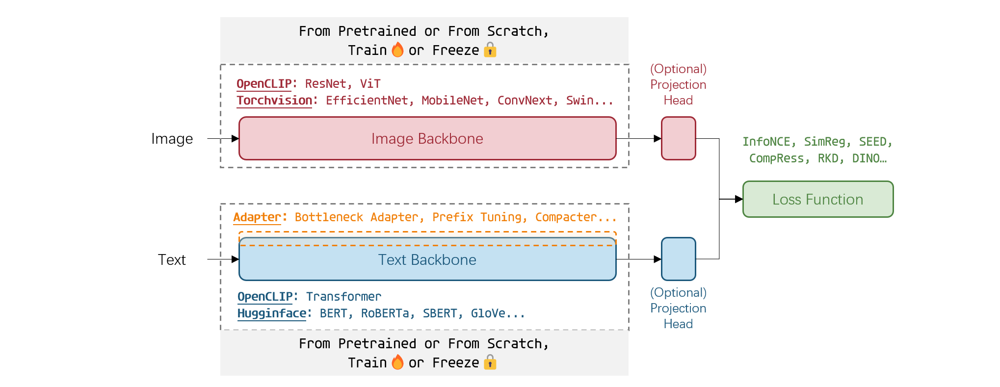

<!-- Improved compatibility of back to top link: See: https://github.com/othneildrew/Best-README-Template/pull/73 -->
<a name="readme-top"></a>

<p align="center">

</p>

<h2 align="center">
<span><strong>ITRA</strong></span>
</h2>


<h3 align="center">
A codebase for flexible and efficient <b><u>I</u></b>mage <b><u>T</u></b>ext <b><u>R</u></b>epresentation <b><u>A</u></b>lignment
</h3>

See the 👉[**Documentation**](https://itra.readthedocs.io/en/latest/)👈.

<!-- 
<br />
<details>
  <summary>Table of Contents</summary>
  <ol>
    <li>
      <a href="#about-this-codebase">About This Codebase</a>
    </li>
    <li>
      <a href="#getting-started">Getting Started</a>
      <ul>
        <li><a href="#prerequisites">Prerequisites</a></li>
        <li><a href="#installation">Installation</a></li>
      </ul>
    </li>
    <li><a href="#usage">Usage</a></li>
    <li><a href="#roadmap">Roadmap</a></li>
    <li><a href="#contributing">Contributing</a></li>
    <li><a href="#license">License</a></li>
    <li><a href="#contact">Contact</a></li>
    <li><a href="#acknowledgments">Acknowledgments</a></li>
  </ol>
</details>
<br />
 -->

# About This Codebase

**Model Builder**
- [OpenCLIP](https://github.com/mlfoundations/open_clip)
- [Torchvision (v0.12)](https://pytorch.org/vision/0.12/)
- [HuggingFace Transformers](https://huggingface.co/docs/transformers)
- [Sentence Transformers](https://www.sbert.net/docs/pretrained_models.html)
- [Adapter-Transformers](https://github.com/adapter-hub/adapter-transformers)

**Training Objectives**
- CLIP: InfoNCE, ProtoCLIP
- Self-supervised KD: RKD, SEED, CompRess, ProtoCPC, SimReg
- VICReg, BarlowTwins, DINO

**Downstream Evaluation**
- Image classification: zero-shot, linear/k-NN, and clustering evaluation (AMI, NMI) (from [ProtoCLIP](https://github.com/megvii-research/protoclip))
- [EVEVATER Image Classification Toolkit](https://github.com/Computer-Vision-in-the-Wild/Elevater_Toolkit_IC) on 20 datasets
- Image-text retrieval on MS-COCO dataset
- Sentence embeddings ([SentEval](https://github.com/facebookresearch/SentEval))
- Passage retrieval on MS-MARCO and Wiki Sections
- Word embeddings: RG65, Simlex999, WordSim353
- Zero-shot VQA ([TAP-C](https://arxiv.org/abs/2203.07190)) and visual entailment 


# Getting Started
## 1. Install Dependencies
- Create a conda environment and install PyTorch:

    ```bash
    conda create -n ITRA python=3.10.0
    conda activate ITRA
    ```

    This repo requirs PyTorch (1.11.0) and torchvision. Please install them via https://pytorch.org/get-started/locally

    ```
    conda install pytorch==1.11.0 torchvision==0.12.0 torchaudio==0.11.0 cudatoolkit=10.2 -c pytorch -y
    # conda install pytorch==1.12.0 torchvision==0.13.0 torchaudio==0.12.0 cudatoolkit=10.2 -c pytorch
    ```

 - Clone this repo:

    ```bash
    git clone https://github.com/megvii-research/protoclip
    cd protoclip
    export PYTHONPATH="$PYTHONPATH:$PWD/src"
    ```
    **Note**: If import error is occured later, run `export PYTHONPATH="$PYTHONPATH:$PWD/src"` again.

- Install additional dependencies:
    ```bash
    conda install pillow pandas scikit-learn faiss-gpu ftfy tqdm matplotlib pycocotools wandb
    conda install -c huggingface transformers 
    conda install -c conda-forge sentence-transformers
    pip install adapter-transformers
    # TODO: remove nori dependency
    pip install nori2
    ```
- ELEVATOR dependencies

    ```
    pip install yacs timm git+https://github.com/haotian-liu/CLIP_vlp.git vision-evaluation

    yacs~=0.1.8
    scikit-learn
    timm~=0.4.12
    numpy~=1.21.0
    sharedmem
    git+https://github.com/openai/CLIP.git
    git+https://github.com/haotian-liu/CLIP_vlp.git
    torch~=1.7.0
    PyYAML~=5.4.1
    Pillow~=9.0.1
    torchvision~=0.8.0
    vision-evaluation>=0.2.2
    vision-datasets>=0.2.0
    tqdm~=4.62.3
    transformers~=4.11.3
    protobuf~=3.20.1
    ftfy~=6.1.1
    nltk~=3.7
    ```
    

## 2. Prepare Pretraining Data
This codebase reads a `CSV` file (separated by `\t`) with two columns: a path to an image ("filepath" by default), and a text caption ("title" by default).

| filepath          | title                      |
|-------------------|----------------------------|
| path/to/image.jpg | A very typical bus station |
| ...               | ...                        |

The script `src/utils/gather_cc.py` will collect the [Conceptual Captions](https://github.com/google-research-datasets/conceptual-captions) (CC3M) dataset. First, download the Conceptual Captions URLs from [here](https://ai.google.com/research/ConceptualCaptions/download), then run the following script:

```bash
python3 src/utils/gather_cc.py path/to/Train_GCC-training.tsv
```

**Note**: The requirement of CC3M validation data of OpenCLIP is removed in this codebase. The CC3M dataset was made public by Google in 2018. As noted in our paper, the number of accessible images keeps drooping due to expired image links. This issue is raised by several recent works. In this work, since we can only collect 2,643,718 images (concurrent to our work, [CyCLIP](https://arxiv.org/abs/2205.14459) collected 2,631,703 images), we randomly sample a 2,500,000 subset (75\% of full CC3M) from them to train our ProtoCLIP. Considering the dropping accessibility of image links in Conceptual Captions, we call for the use of this dataset size (2.5M) in future benchmarking for better comparability.

**Note**: `webdataset` is no longer supported in this codebase.


## 3. Prepare Downstream Data
- **Zero-shot Classification**. The preprocessed zero-shot datasets can be downloaded from [CLOOB](https://github.com/ml-jku/cloob#downstream-tasks).

- **Linear Probing**. We perform linear evaluation on ImageNet, CIFAR10, CIFAR100, and STL10. You need to download the full [ImageNet-1k](https://image-net.org/download.php) dataset manually. The later three datasets are integrated into `torchvision` and will be downloaded automatically.

- **Image-text Retrieval**. We implement zero-shot image-text retrieval on MS-COCO. Since we do not perform fine-tuning, only the validation split (`/val2017`) is required here.

    
    ```
    # All downstream datasets shall be stored to <YOUR DATASET ROOT> dictionary:
    <YOUR DATASET ROOT>
        ├── imagenet
        │   ├── train
        │   └── test  
        ├── birdsnap
        │   └── test
        ├── country211
        │   └── test
        ├── flowers102
        │   └── test
        ├── gtsrb
        │   └── test
        ├── stanford_cars
        │   └── test
        ├── ucf101
        │   ├── testlist01
        │   ├── testlist02
        │   └── testlist03   
        └── coco2017
           ├── annotations
           └── val2017 
    ```

- **STS**
https://github.com/princeton-nlp/SimCSE#evaluation

- **MS MARCO**

- **wiki sections**

- EVEVATER Image Classification Toolkit

    [EVEVATER Image Classification Toolkit](https://github.com/Computer-Vision-in-the-Wild/Elevater_Toolkit_IC) (Elevater_Toolkit_IC) implemeted standarlized evaluations of vision language models. It covers zero-shot classification, few- / full-shot linear probing, and fully fine tuning on 20 datasets. See paper "*[ELEVATER: A Benchmark and Toolkit for Evaluating Language-Augmented Visual Models](https://arxiv.org/abs/2204.08790), NeurIPS 2022 Datasets and Benchmarks Track*" for more details.

    We have included Elevater_Toolkit_IC in our codebase (in `src/training/evaluations/vision_benchmark`). We have registered new models ([clip_zeroshot_eval.py]((src/training/evaluations/vision_benchmark/models/clip_zeroshot_eval.py)) and [cls_linear_or_ft_eval.py]((src/training/evaluations/vision_benchmark/models/cls_linear_or_ft_eval.py))) following the official instructions. To ensure compatibility, we have made some modifications based on the official Elevater_Toolkit_IC codes at commit `9d39620`, so DO NOT install an Elevater_Toolkit_IC in the environment for this codebase.

    To get started first download all dataset following [this repo](https://github.com/Computer-Vision-in-the-Wild/DataDownload). The downloaded datasets takes about 41Gb storage, and the folder structure should be: 


    ```bash
    .../datasets
    └── classification
        ├── caltech_101_20211007
        │   ├── labels.txt
        │   ├── test.txt
        │   ├── test.zip
        │   ├── train.txt
        │   └── train.zip
        ├── cifar100_20200721
        │   ├── labels.txt
        │   ├── test_images.txt
        │   ├── test_images.zip
        │   ├── train_images.txt
        │   └── train_images.zip
        ...
        └── voc2007_20211007
            ├── labels.txt
            ├── test_ic.txt
            ├── test.zip
            ├── train_ic.txt
            ├── train.zip
            └── val_ic.txt

    21 directories, 115 files
    ```


# Usage

## Training 
### Model Architechture

#### **Image Backbone**

- **From `OpenCLIP` (v2.0.2)**. [OpenCLIP](https://github.com/mlfoundations/open_clip) is an open source implementation of [OpenAI's CLIP](https://github.com/openai/CLIP) (Contrastive Language-Image Pre-training). To check all supported model architecture and pretrained weigths, run:

    ```python
    import open_clip
    open_clip.list_pretrained()
    ```

    ```bash
    --image-model-builder 'openclip' --image-model 'RN50' \
    --image-model-builder 'openclip' --image-model 'RN50' --image-model-tag 'openclip' --pretrained-image-model \
    --image-model-builder 'openclip' --image-model 'RN50' --image-model-tag 'yfcc15m' --pretrained-image-model  \
    --image-model-builder 'openclip' --image-model 'RN50' --image-model-tag 'cc12m' --pretrained-image-model  \
    ...
    ```

- **From `Torchvision` (v0.12)**. To check all supported model architecture and pretrained weigths, run the following command or see [this page](https://pytorch.org/vision/0.12/models.html).

    ```python
    import torchvision
    torchvision.models.__dict__.keys()
    ```
    
    ```bash
    --image-model-builder 'torchvision' --image-model 'resnet50' \
    --image-model-builder 'torchvision' --image-model 'resnet50' --pretrained-image-model \
    --image-model-builder 'torchvision' --image-model 'alexnet' \
    --image-model-builder 'torchvision' --image-model 'convnext_tiny' \
    --image-model-builder 'torchvision' --image-model 'wide_resnet50_2' \
    --image-model-builder 'torchvision' --image-model 'vgg11' \
    --image-model-builder 'torchvision' --image-model 'squeezenet1_0' \
    --image-model-builder 'torchvision' --image-model 'inception_v3' \
    --image-model-builder 'torchvision' --image-model 'mobilenet_v3_small' \
    --image-model-builder 'torchvision' --image-model 'mnasnet0_5' \
    --image-model-builder 'torchvision' --image-model 'shufflenet_v2_x0_5' \
    --image-model-builder 'torchvision' --image-model 'efficientnet_b0' \
    --image-model-builder 'torchvision' --image-model 'regnet_y_400mf' \
    --image-model-builder 'torchvision' --image-model 'vit_b_16' \
    ```


- **From `Torch Hub`**.
    ```python
    import torch
    for github in ['swav', 'dino', 'vicreg', 'barlowtwins', 'swag', 'deit']:
        print(f'{github}:\t', torch.hub.list(f'facebookresearch/{github}'))
    ```

    ```bash    
    --image-model-builder 'torchhub' --image-model 'resnet50' --image-model-tag 'facebookresearch/swav:main' \
    --image-model-builder 'torchhub' --image-model 'dino_vits16' --image-model-tag 'facebookresearch/dino:main' \
    --image-model-builder 'torchhub' --image-model 'resnet50' --image-model-tag 'facebookresearch/vicreg:main' \
    --image-model-builder 'torchhub' --image-model 'resnet50' --image-model-tag 'facebookresearch/barlowtwins:main' \
    --image-model-builder 'torchhub' --image-model 'regnety_16gf' --image-model-tag 'facebookresearch/swag:main' \
    ...
    ```
    
    For more details, see:
    - https://github.com/facebookresearch/swav
    - https://github.com/facebookresearch/dino
    - https://github.com/facebookresearch/vicreg
    - https://github.com/facebookresearch/barlowtwins
    - https://github.com/facebookresearch/vicregl
    - https://github.com/facebookresearch/SWAG
    - https://github.com/facebookresearch/deit/blob/main/README_deit.md


### **Text Backbone**
- **From `OpenCLIP`**. Here the alternatives of the text encoder are exactly the same as OpenCLIP's image backbone.

- **From HuggingFace🤗Transformers**. For more details, see [HuggingFace Transformers](https://huggingface.co/docs/transformers). Currently, only 'from pretrained' mode is supported (i.e., you cannot train a huggingface transformer from scratch now). Standard models like BERT/RoBERTa are supported, but whether other models are also supported is not sure...

- **From Sentence Transformers**. The [Sentence Transformers](https://www.sbert.net) liberary provides powerfull sentence embeddings. Please see [pretrained models](https://www.sbert.net/docs/pretrained_models.html) for more detials. Loading sentence transformers via huggingface and specify `--text-pooler='mean'` is recommended, though it is also supported to load the model via sentence transformer:

    ```bash
    # recommended: 
    --text-model-builder 'huggingface'  --text-model 'sentence-transformers/all-mpnet-base-v2' --text-pooler='mean' 
    # not recommended:
    --text-model-builder 'sbert'  --text-model 'all-mpnet-base-v2' 
    ```

    However, it seems that word embedding models ([GloVe](https://huggingface.co/sentence-transformers/average_word_embeddings_glove.6B.300d) and [Komninos](https://huggingface.co/sentence-transformers/average_word_embeddings_komninos)) in sentence-transformers cannot be loaded via huggingface.

- **From Adapter-Transformers**. The [Adapter-Transformers](https://github.com/adapter-hub/adapter-transformers) liberary enables Delta-tuning on popular huggingface transformers. See [Model Overview](https://docs.adapterhub.ml/model_overview.html) for available adaptations, and see the [Docs](https://docs.adapterhub.ml/) and [AdapterHub](https://adapterhub.ml/) for more details.

    We have made the following adapters available in this codebase:

    | Method                                                                                                        | args.adapter       |         |
    |---------------------------------------------------------------------------------------------------------------|--------------------|------------|
    | [Bottleneck   adapters](https://docs.adapterhub.ml/overview.html#bottleneck-adapters)                         | `bottleneck_adapter` |          |
    | [Language Adapters](https://docs.adapterhub.ml/overview.html#language-adapters-invertible-adapters)           | `lang_adapter`       |          |
    | [Prefix   Tuning](https://docs.adapterhub.ml/overview.html#prefix-tuning)                                     | `prefix_tuning`      |          |
    | [Compacter](https://docs.adapterhub.ml/overview.html#compacter)                                               | `dummy`              |          |
    | [LoRA](https://docs.adapterhub.ml/overview.html#lora)                                                         | `lora_adapter`       |          |
    | [(IA)^3](https://docs.adapterhub.ml/overview.html#ia-3)                                                       | `ia3_adapter`        |          |
    | [Mix-and-Match   Adapters](https://docs.adapterhub.ml/overview.html#mix-and-match-adapters)                   | `mam_adapter`        |          |
    | [UniPELT](https://docs.adapterhub.ml/overview.html#unipelt)                                                   | `unipelt`            |          |


### **Projection Head**

- Linear projection head

- [DINO MLP Head](https://github.com/facebookresearch/dino/blob/cb711401860da580817918b9167ed73e3eef3dcf/vision_transformer.py#L257) (optionally with a prototype layer in the last)


## Loss Function

| Loss        | Original Task | Paper                                                                                            | Source Implementation                                                          | Uni-Directional | Need Prototype Layer |
|-------------|---------------|--------------------------------------------------------------------------------------------------|--------------------------------------------------------------------------------|-----------------|----------------------|
| InfoNCE     | Alignment     | Learning Transferable Visual Models From Natural Language Supervision                            | https://github.com/mlfoundations/open_clip/blob/main/src/open_clip/loss.py#L65 |                 |                      |
| SimReg      | KD            | SimReg:   Regression as a Simple Yet Effective Tool for Self-supervised Knowledge   Distillation | https://github.com/UCDvision/simreg/blob/main/simreg.py#L122                   |                 |                      |
| RKD         | KD            | Relational Knowledge Distillation                                                                | https://github.com/lenscloth/RKD/blob/master/metric/loss.py#L136               |                 |                      |
| CompRess-1q | KD            | CompRess: Self-Supervised Learning by Compressing Representations                                | https://github.com/UMBCvision/CompRess/blob/master/nn/compress_loss.py#L67     | &#10004;        |                      |
| CompRess-2q | KD            | CompRess: Self-Supervised Learning by Compressing Representations                                | https://github.com/UMBCvision/CompRess/blob/master/nn/compress_loss.py#L89     |                 |                      |
| SEED        | KD            | SEED: Self-supervised Distillation For Visual Representation                                     | https://github.com/jacobswan1/SEED/blob/master/tools/utils.py#L188             | &#10004;        |                      |
| VICReg      | SSL           | VICReg: Variance-Invariance-Covariance Regularization For Self-Supervised   Learning             | https://github.com/facebookresearch/vicreg/blob/main/main_vicreg.py#L184       |                 |                      |
| BarlowTwins | SSL           | Barlow Twins: Self-Supervised Learning via Redundancy Reduction                                  | https://github.com/facebookresearch/barlowtwins/blob/main/main.py#L187         |                 |                      |
| DINO        | SSL           | Emerging Properties in Self-Supervised Vision Transformers                                       | https://github.com/facebookresearch/dino/blob/main/main_dino.py#L363           | &#10004;        | &#10004;             |


## Downstream Evaluation
- Image Classification (ELEVATER?)
- Image-text Retrieval
- Sentence Similarity
- MS MARCO Passage Retrval...


Then you can perform EVEVATOR evaluations of the model trained by this codebase, by making necessary modifications and run the following commands:

```bash
conda activate vlkd
cd /data/codes/ProtoRKD 
export PYTHONPATH="$PWD/src/training/evaluations:$PWD/src"

# zero-shot:       model_cfg='clip_zeroshot_eval'      mode='zeroshot'\
# few-shot:        model_cfg='cls_linear_or_ft_eval'   mode='linear_probe' num_shots=5 \
# linear prob:     model_cfg='cls_linear_or_ft_eval'   mode='linear_probe' num_shots=-1 \
# fine-tune:       model_cfg='cls_linear_or_ft_eval'   mode='finetune'     num_shots=-1 \

for dataset (caltech101 cifar10 cifar100 country211 dtd eurosat-clip fer2013 fgvc-aircraft-2013b flower102 food101 gtsrb hateful-memes kitti-distance mnist oxford-iiit-pets patchcamelyon rendered-sst2 resisc45-clip stanfordcar voc2007classification)
{       
    #---> REPLACE THIS LINE WITH ONE OF FOUR OPTIONS ABOVE <---#
    log_dir=# <YOUR EXPERIMENT DIR> \
    ckpt_epoch=# <WHICH EPOCH> \
    dataset_root=# <YOUR DATASET DIR> \
    dataset=$dataset \
    disable_hyperparameter_tuning=True \
        bash run_evevater_eval.sh
}
```

for example,
```bash
conda activate vlkd
cd /data/codes/ProtoRKD 
export PYTHONPATH="$PWD/src/training/evaluations:$PWD/src"

for dataset (caltech101 cifar10 cifar100 country211 dtd eurosat-clip fer2013 fgvc-aircraft-2013b flower102 food101 gtsrb hateful-memes kitti-distance mnist oxford-iiit-pets patchcamelyon rendered-sst2 resisc45-clip stanfordcar voc2007classification)
{       
    model_cfg='cls_linear_or_ft_eval'   mode='finetune'     num_shots=-1 \
    log_dir='/data/codes/ProtoRKD/logs/codebase_test/U[mobilenet_v3_large-h2]-L[CLIP-from-RN50]-bs1024-YFCC-56ep-lr1e-5' \
    ckpt_epoch=56 \
    dataset=$dataset \
    disable_hyperparameter_tuning=True \
    dataset_root='/data/codes/ProtoRKD/src/training/evaluations/vision_benchmark/outputs/datasets'\
        bash run_evevater_eval.sh
}

```

Then you can generate submission file for [EvalAI](https://eval.ai/web/challenges/challenge-page/1832/overview). For more details, please see [official instructions](https://github.com/Computer-Vision-in-the-Wild/Elevater_Toolkit_IC#submit-to-leaderboard).


```bash
python src/training/evaluations/vision_benchmark/commands/prepare_submit.py \
  --combine_path 'logs/codebase_test/L[mobilenet_v3_small-h2]-L[CLIP-from-RN50]-bs1024-YFCC-8ep/clip_zeroshot_eval/log/predictions/zeroshot_eval_wiki_False_wnh_False_wnd_False_gpt3_Falseagg_WIKI_AND_GPT3_gpt3count_0'
```

We provide a simple script to summarize the results:
```bash
python src/utils/summarize_ELEVATER_results.py
Input your log dir (end with "../ELEVATER_evaluation/<eval_mode>"):
>>> logs/U[mobilenet_v3_large-h2]-L[CLIP-from-RN50]-bs1024-YFCC-56ep-lr1e-5/ELEVATER_evaluation/zeroshot
                           Dsataset  zeroshot-accuracy%
0                       caltech-101             70.4490
1                          cifar-10             72.8000
2                         cifar-100             37.1700
3                        country211              7.0570
4                               dtd             31.5430
5                      eurosat_clip             25.3000
6                          fer-2013             21.8170
7   fgvc-aircraft-2013b-variants102              5.1620
8                 oxford-flower-102             45.4590
9                          food-101             40.3290
10                            gtsrb              8.8600
11                    hateful-memes             52.4110
12                   kitti-distance             14.3460
13                            mnist             11.0400
14                 oxford-iiit-pets             65.2600
15                   patch-camelyon             50.7600
16                    rendered-sst2             47.8860
17                    resisc45_clip             23.2740
18                    stanford-cars              5.0990
19          voc-2007-classification             77.5720
20                          Average             35.6797
saved to logs/U[mobilenet_v3_large-h2]-L[CLIP-from-RN50]-bs1024-YFCC-56ep-lr1e-5/ELEVATER_evaluation/zeroshot/summary.csv
```

